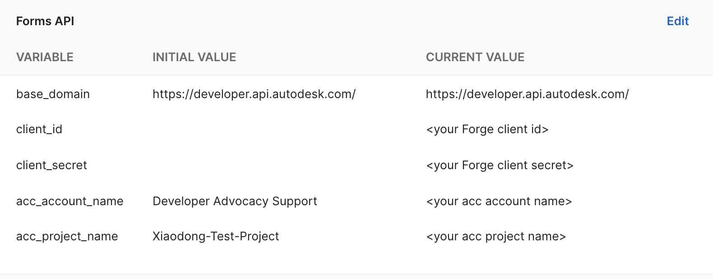
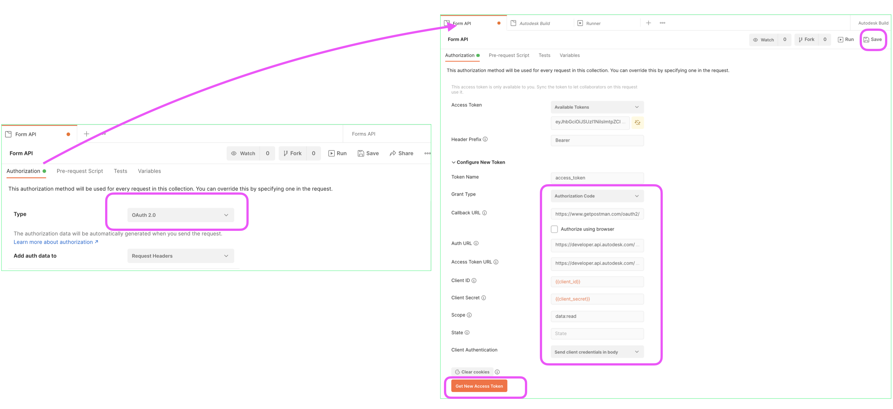
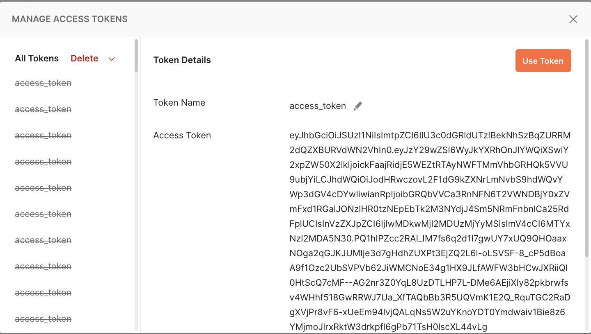
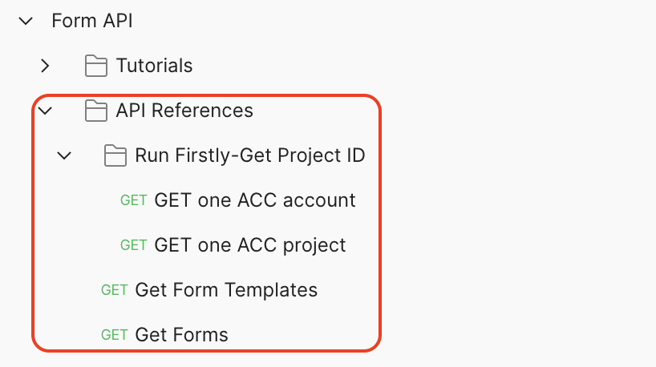
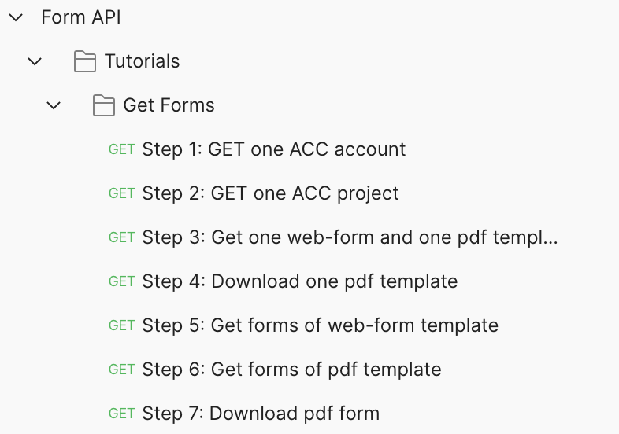
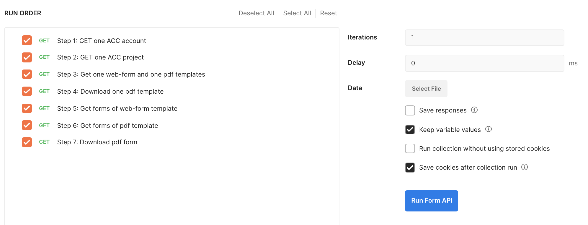
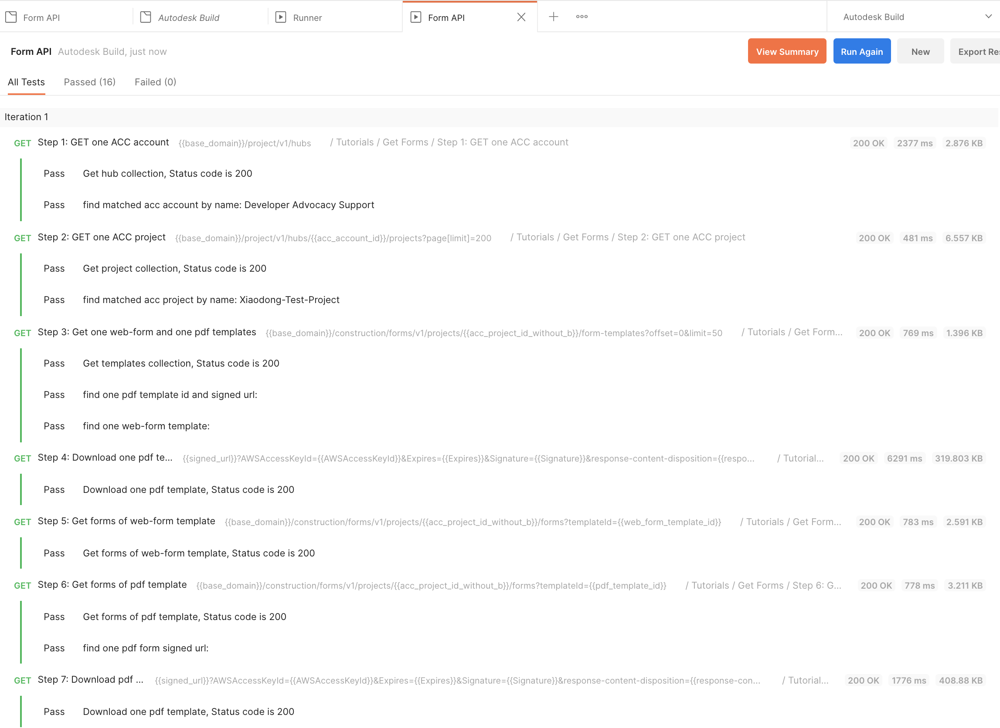

# Postman Collection for Form API 
  
This folder contains scripts of tutorials and API reference that could help you understand the usage of **Form API** of Autodesk Build.The environment file and collection file are provided. 

- Tutorial: includes a set of scripts on some use scenarios of Form API . It is based on the tutorial on Form API documentation of Forge website.
- API References: includes Form API list that helps quick test or verify each endpoint.

 
## Prerequesiites

1.  **Forge Account**: Learn how to create a Forge Account, activate the subscription and create an app by [this tutorial](http://learnforge.autodesk.io/#/account/). Get Forge _client id_, _client secret_ and  _callback url_. Please register Forge app with the _callback url_ as 

    ```https://www.getpostman.com/oauth2/callback```

2. **ACC Account and project**: must be Account Admin to add the app integration. [Learn about provisioning](https://forge.autodesk.com/blog/bim-360-docs-provisioning-forge-apps). Make a note with the __account name__. Create a project and make a note with the __project name__.

3. **Form Data**: Follow [this help](https://help.autodesk.com/view/BUILD/ENU/?guid=Build_Forms_about_forms_html) of Form to prepare some Form templates (pdf and web-form), and prepare some forms that come from templates. At least one form from pdf template and one form from web-form template.

4. The API requires 3 legged token. Ensure the user (to autoruzie data access of the Forge app) is project member and is collaborator or reviewer of Form. 

## Setup Postman environment and Authorization:
1. Import Postman environment & collection, please setup the following environment vialables, 
    - client_id:     Forge App Id.
    - client_secret: Forge App Secret.
    - acc_account_name: The name of ACC account that you want to test with.
    - acc_project_name:  The project name that you want to test with.
   <p align="center"></p>   

2. Please add the Authorization for the collection, click **Edit Collection**, go to **Authorization** tab, make sure to use **OAuth 2.0** to get a 3 legged token, use it in the **Request Headers**. Scope depends on the required scopes of the API endpoints. you need to check [API references](https://forge.autodesk.com/en/docs/acc/v1/tutorials/forms) to confirm if which scopes are required.

    - Grant Type ``Authorization Code``
    - Callback URL  ``https://www.getpostman.com/oauth2/callback``
    - Auth URL  ``https://developer.api.autodesk.com/authentication/v1/authorize``
    - Access Token URL  ``https://developer.api.autodesk.com/authentication/v1/gettoken``

    - Client ID ``{{client_id}}``
    - Client Secret ``{{client_secret}}``
    - Scope ``data:read``
    - Client Authentication ``Send Client credentials body``
   <p align="center"></p>   

 3. Click **Get New Access Token**, it will direct to login Autodesk account, after it succeeds, the token will be generated. Click **Proceed**. Then, **Use Token**, finally click **Save** on top right of the Authorization tab.

    Form API requires to work with 3-legged token. This collection takes **[Inheriting auth](https://learning.getpostman.com/docs/postman/sending-api-requests/authorization/#inheriting-auth)** to apply 3-legged token to every endpoint in the collection automatically, which means it does not need to input the token in the header explicitly.
   <p align="center"></p>   


## API Endpoint Test
1. Assume the steps of **Setup** have been performed. The access token is ready.

2. The scripts assumes account id and project id is available. Run the Run the scripts in the folder __Firstly-Get Project ID__ firstly. It will get the account id and project id by __acc_account_name__ and __acc_project_name__ defined in the environment.

3. Play the scripts. Try to change some parameters or body with more scenarios. 
   <p align="center"></p>   

## Tutorial Test
1. Assume the steps of **Setup** have been performed. The access token is ready.
2. Play the scripts in sequence. Check its Post-Test status if it succeeded or not.
3. With [Postman Runner](https://learning.postman.com/docs/running-collections/intro-to-collection-runs/), these scripts can be chained to perform auto-test. Check **Tests** tab to define your preferred tests.
   <p align="center"></p>   

4. The steps of Tutorial may be slighly different to that in API documentation of Forge website. 
   <p align="center"></p>   
   <p align="center"></p>   


## Tips & Tricks
- These endpoints are mainly used to quick test|verfify based on your good understanding with Form API. If the individual endpoint may not work, you need to check the error message and compare with the API reference if any parameters are wrong/missing.  

## License

This sample is licensed under the terms of the [MIT License](http://opensource.org/licenses/MIT). Please see the [LICENSE](LICENSE) file for full details.

## Written by

Xiaodong Liang [@coldwood](https://twitter.com/coldwood), [Developer Advocate and Support](http://forge.autodesk.com)

