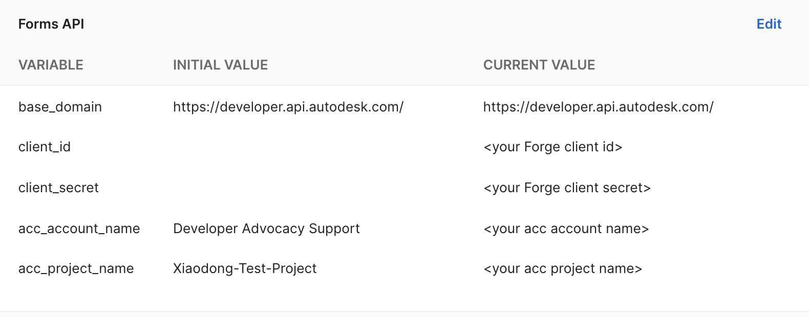
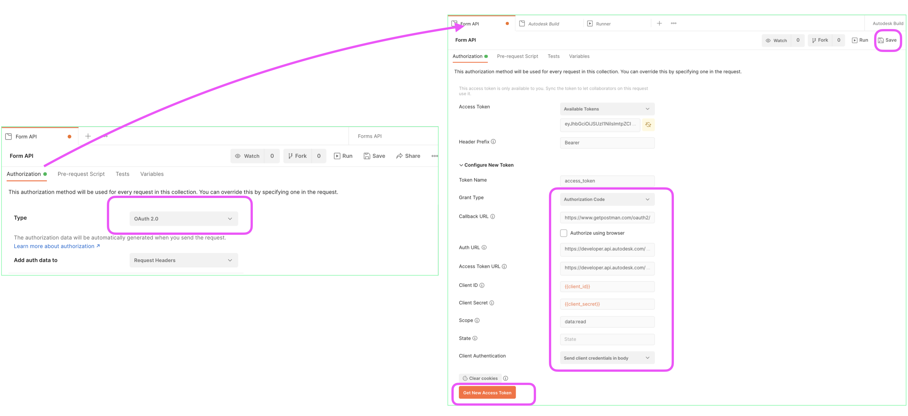
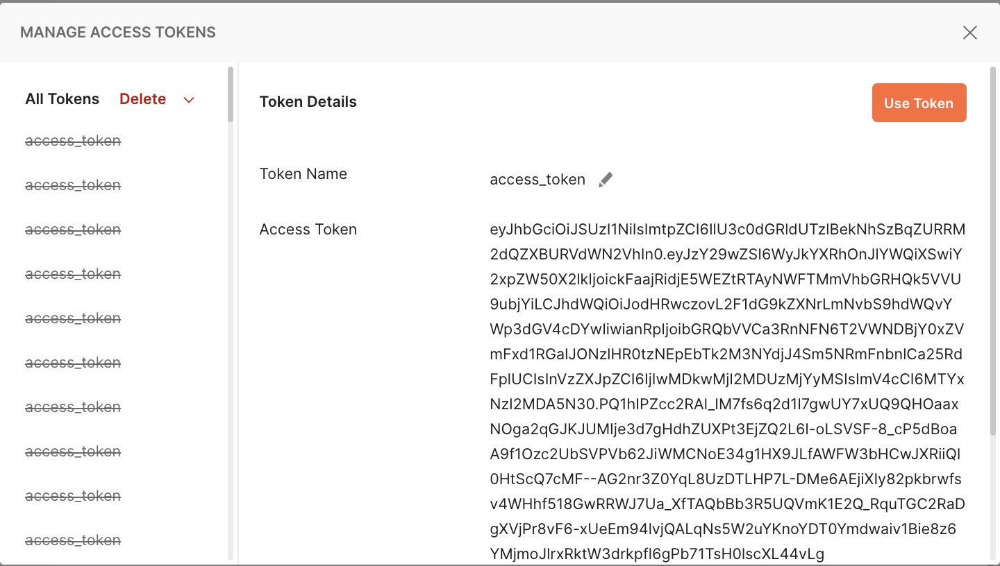
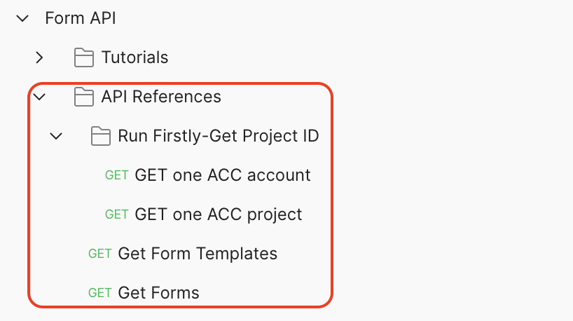
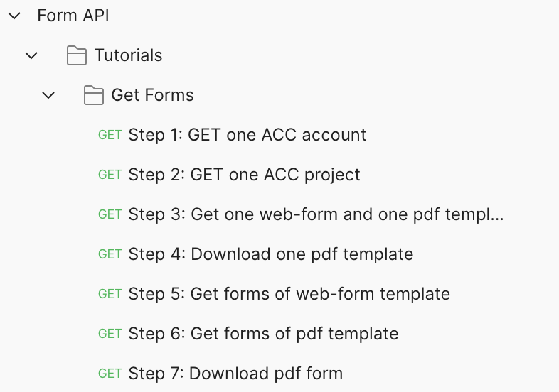
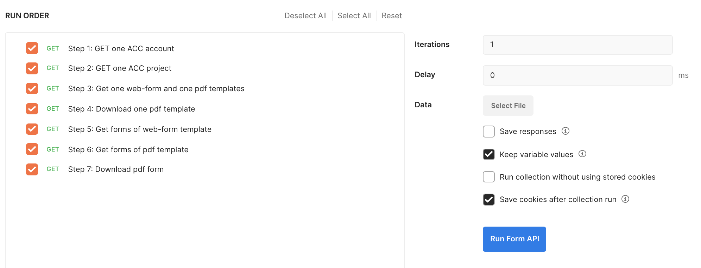
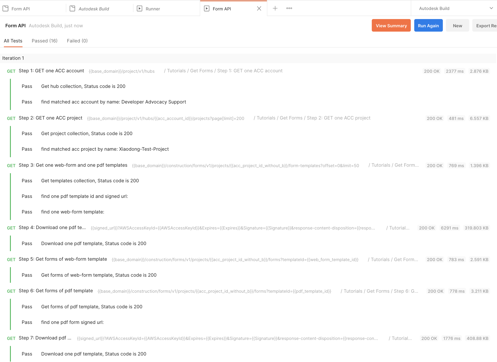

# Postman Collection for Forms API 

[](https://www.getpostman.com/)
[](https://forge.autodesk.com/en/docs/acc/v1/overview/)

[](http://opensource.org/licenses/MIT)

Forms is one of modules in Autodesk Build. It allows your team to securely fill out, review, and manage project forms, in a format of checklist fields. The template can be a web form defined by template builder, or from a pdf file with smart fields. The contributors create form with the template and input their answer, options, notes, signatures etc. The form will be submitted finally for reviewers to review. Check [product help](https://help.autodesk.com/view/BUILD/ENU/?guid=Build_Forms_about_forms_html) for details.

## Description

This repository provides demos for Forms API. Currently, the public APIs:
 - GET form-templates
 - GET forms  

The collection will be kept updated with new APIs.  

## Setup

1.  **Forge Account**: Learn how to create a Forge Account, activate the subscription and create an app by [this tutorial](http://learnforge.autodesk.io/#/account/). Get Forge _client id_, _client secret_ and  _callback url_. Please register Forge app with the _callback url_ as 

    ```https://www.getpostman.com/oauth2/callback```

2. **Autodesk Construction Cloud Account and Project**: must be Account Admin to add the app integration. [Learn about provisioning](https://forge.autodesk.com/blog/bim-360-docs-provisioning-forge-apps). Make a note with the __account name__

3. Create one ACC project and activate Autodesk Build. Make a note with the __project name__ .

4. Create some Forms with Forms template, and create some custom templates. 

5.  Clone this repository or download it. It's recommended to install [GitHub Desktop](https://desktop.github.com/). To clone it via command line, use the following (**Terminal** on MacOSX/Linux, **Git Shell** on Windows):

    ```git clone https://github.com/Autodesk-Forge/forge-autodesk.build.api-postman.collection```

5. Import the collection and environment files to Postman

6. In environment, input _client id_, _client secret_, _acc_account_name_ and _acc_project_name_.

   <p align="center"></p>  

## Generate Token

This collection takes **[Inheriting auth](https://learning.getpostman.com/docs/postman/sending-api-requests/authorization/#inheriting-auth)** to apply token to every endpoint in the collection automatically, which means it does not need to input the token in the header explicitly.

Forms API endpoints support 3-legged token only.

   In context menu of collection >> **Edit**, switch to the tab **Authorization**. switch type to **OAuth 2.0**:
   <p align="center"></p> 

   input the variables in __Authorization__.

   - Grant Type ``Authorization Code``
   - Callback URL  ``https://www.getpostman.com/oauth2/callback``
   - Auth URL  ``https://developer.api.autodesk.com/authentication/v1/authorize``
   - Access Token URL  ``https://developer.api.autodesk.com/authentication/v1/gettoken``
   - Client ID ``{{client_id}}``
   - Client Secret ``{{client_secret}}``
   - Scope ``data:read``
   - Client Authentication ``Send Client credentials body``

   Click **Get New Access Token**, it will direct to login Autodesk account, after it succeeds, the token will be generated. Click **Save** if it is enabled.  

   <p align="center"></p> 

## API Test

1. Assume the steps of **Setup** have been performed. The access token is ready.

2. Play the scripts of single endpoints or tutorial endpoints in sequence. Try to change some parameters or body with more scenarios. 
   <p align="center"></p> 
      <p align="center"></p> 
  ensure to run the prerequesite endpoints to get account id and project id.

3. With [Postman Runner](https://learning.postman.com/docs/running-collections/intro-to-collection-runs/), these scripts can be chained to perform auto-test. Check **Tests** tab to define your preferred tests.

   <p align="center"></p> 
   <p align="center"></p> 

## License

This sample is licensed under the terms of the [MIT License](http://opensource.org/licenses/MIT). Please see the [LICENSE](LICENSE) file for full details.

## Written by

Xiaodong Liang [@coldwood](https://twitter.com/coldwood), [Developer Advocate and Support](http://forge.autodesk.com)